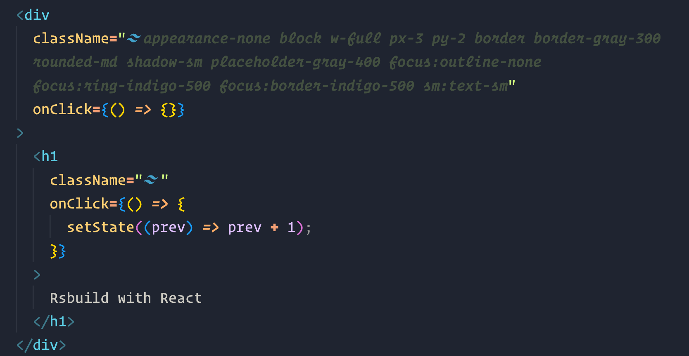
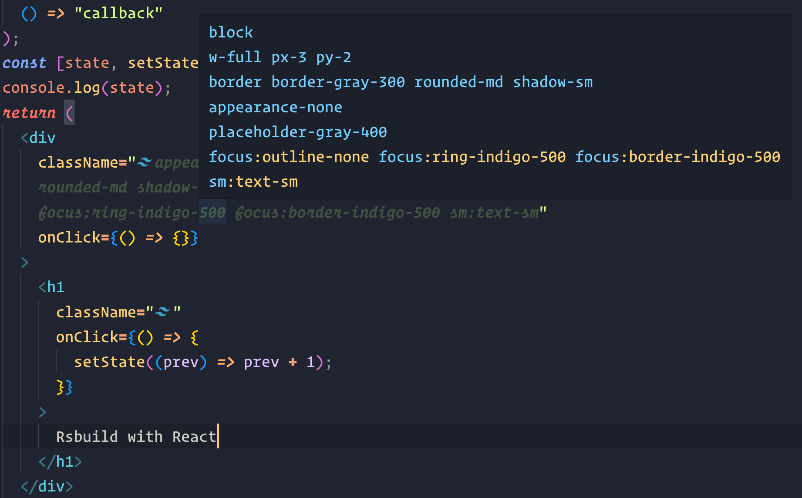

# Tailwind Fold

With Tailwind Fold Opinionated, you can say goodbye to messy and hard-to-read HTML code. This extension helps improve the readability of your code by automatically "folding" long class attributes.

## Features

### Max_length

### Hover pop-up sorted css

## Extension Settings

This extension contributes the following settings:

-   `tailwind-fold.autoFold`: Enable/disable automatic class attribute folding
-   `tailwind-fold.foldStyle`: Defines folding style
-   `tailwind-fold.unfoldIfLineSelected`: Unfolds class attributes if line is selected
-   `tailwind-fold.showTailwindImage`: Show/hide the tailwind logo infront of folded content
-   `tailwind-fold.foldedText`: Text to show when class attributes are folded
-   `tailwind-fold.foldedTextColor`: Color of the text when folded
-   `tailwind-fold.foldedTextBackgroundColor`: Background color of the text when folded
-   `tailwind-fold.unfoldedTextOpacity`: Opacity of unfolded class attributes
-   `tailwind-fold.supportedLanguages`: Array of languages the extension is enabled for
-   `tailwind-fold.foldLengthThreshold`: Specifies the minimum number of characters required for a section to fold
-   `tailwind-fold.foldMaxLength`: Maximum length of content to fold completely (0 = auto-detect from Editor: Word Wrap Column - 10). Content longer than this will be shown with reduced opacity instead of being folded, to avoid blank lines from soft wrap
-   `tailwind-fold.fadedTextOpacity`: Opacity of text when faded (for long classes that exceed foldMaxLength)

## Note

This extension folds all class attributes, even if there are no tailwind specific attributes.

## Credits

This project is forked from [tailwind-fold](https://github.com/stivoat/tailwind-fold) by [stivoat](https://github.com/stivoat), with opinionated defaults and additional features.
